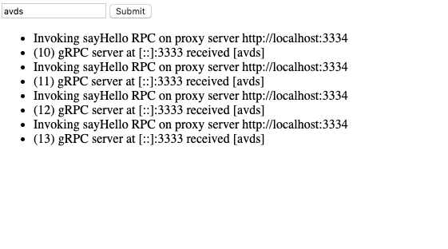

# WebRPCHello
##### A very simple demo for connecting grpc-web in browser to go gRPC backend.


- Go gRPC server
  
    `hello.proto` defins a very simple gRPC service `SayHello` that can take and return a string. 
    `server.go` implements the service by returning the received message 
    with some debug info. 

    `go-server/main.go` starts the go gRPC server and listens at `:3333`.
    
    ```bash
    # compile protoc for go
    protoc -I. --go_out=plugins=grpc:. hello.proto
  
    go install ./...
    # start go server at :3333 
    $GOPATH/bin/go-server
    ```     

    You should see `RPC serving on :3333`.

- Proxy Service  

    Browsers cannot directly connect to a Go gRPC server over TCP. 
    We use [gprcwebproxy](https://github.com/improbable-eng/grpc-web/releases)
    to forward HTTP requests on `:3334` to `:3333` (Go gRPC server). 

    ```bash
    ./grpcwebproxy-v0.9.1-osx-x86_64 --backend_addr=:3333 --server_http_debug_port 3334 --allow_all_origins --run_tls_server=false
    ```
    
    You should see `listening for http on: [::]:3334...`. 

- Node.js gRPC client  

    `js-client/client.js` creates a client that is connected to 
    `3334` (the proxy server). 
    The file exposes `SayHi(msg)` function to invoke the RPC.
    
    `js-client/client.js` is written in CommonJS which cannot
    directly run in browsers. 
    We use `browserify` to pack the node script into one bundle file
    at `js-client/dist/bundle.js`. 
    This file can be directly used in a browser.

    ```bash
    # Compile proto for JS
    # If necessary, provide your plugin location e.g. --plugin=protoc-gen-grpc-web=$HOME/tools/protoc-gen-grpc-web-1.0.7-darwin-x86_64
    protoc -I=. hello.proto --js_out=import_style=commonjs,binary:js-client  --grpc-web_out=import_style=commonjs,mode=grpcwebtext:js-client  
    
    # Use browserify to translate `require` in Node.js
    cd js-client
    npm install grpc
    npm install -g browserify browserify-fs
    mkdir dist
    browserify client.js -d --s client > dist/bundle.js
    ```

- The Frontend
    
    A text-based front-end is provided at `blank.html`.
    Open it in a browser, click on "submit" to invoke the RPC.
    Responses will be printed on DOM and in the console.  

    